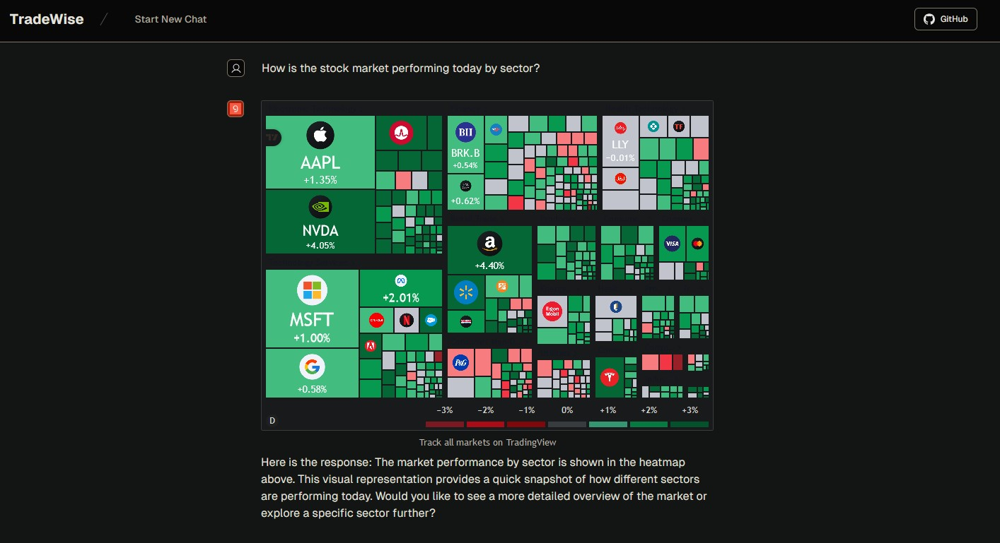
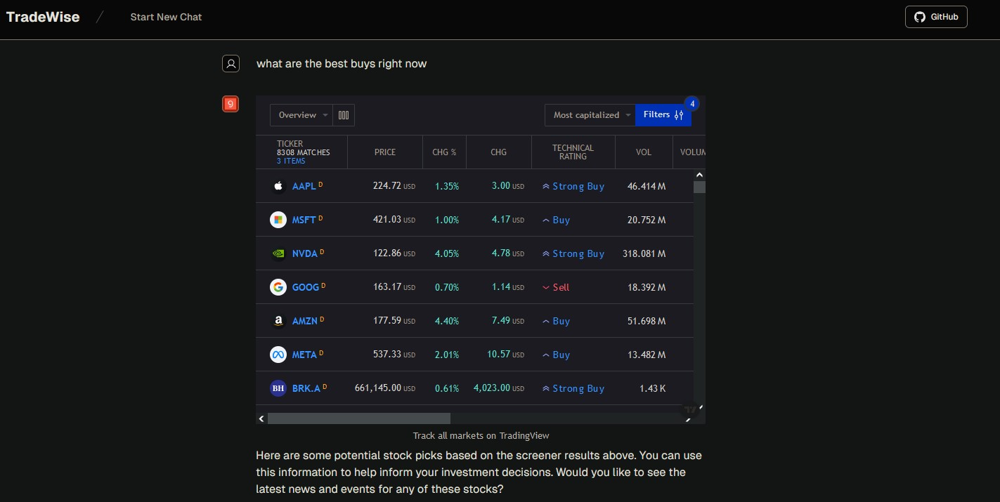

# 🚀 TradeWise: A Lightning Fast AI Chatbot for Real-Time Financial Data, Charts, News, and More!

[Overview](#overview) • [Features](#features) • [Interfaces](#interfaces) • [Quickstart](#quickstart) • [Credits](#credits)

## Overview

We at FalconX are thrilled to unveil TradeWise – the financial assistant that's about to revolutionize your trading game!

Imagine having a financial genius in your pocket, ready to provide instant responses to your every query. That's TradeWise – offering a level of speed and functionality that will leave you wondering how you ever traded without it.

TradeWise is a lightning-fast, AI-powered chatbot that puts the pulse of the markets at your fingertips. Fueled by the cutting-edge Llama3.1-70B-Groq engine, this digital dynamo delivers real-time financial data, interactive charts, and breaking market news with unparalleled speed and precision.

⚠️ **Important**: TradeWise is designed for informational purposes only and does not provide financial advice.

https://github.com/user-attachments/assets/1e9c497d-a0d8-4e87-8de8-8035ceecee56

## 🌟 Key Features

- 🧠 **AI Brain**: Chat with TradeWise to get instant insights on stocks, market trends, and financial news.
- 📊 **Visual Feast**: Devour data through stunning, interactive charts that bring numbers to life
- 🌍 **Global Reach**: Access financial intel from every corner of the globe, 24/7
- ⚡ **Lightning Fast**: Get answers at the speed of thought, powered by Llama3.1-70B Groq
- 🎯 **Precision Analysis**: Dive deep into stocks, forex, crypto, and more with laser-focused accuracy

## 🛠️ TradeWise Toolkit

| Powerhouse Tool | What It Does |
|-----------------|--------------|
| 🔥 TrendSpotter | Instantly grasp market momentum with our dynamic, color-coded heatmap. |
| 💹 StockX-Ray | Dissect any stock's vital signs with our comprehensive financial health scanner. |
| ⏳ TimeWarp | Journey through a stock's price history with our customizable time-travel chart. |
| 🕯️ CandleForge | Master market psychology with our advanced, interactive candlestick charting. |
| 📡 NewsRadar | Stay ahead of the curve with real-time, AI-curated stock-specific news feeds. |
| 🌐 GlobalPulse | Feel the heartbeat of world markets across stocks, futures, bonds, and forex. |
| 🎯 StockHunter | Uncover hidden gems and potential rockets with our smart stock screening engine. |
| 🏆 MarketMovers | Spot today's champions and underdogs with our real-time stock performance tracker. |
| 🗺️ ETF Explorer | Navigate the ETF landscape with our sector and asset class performance visualizer. |

## Quickstart

🚀 **Getting Started**: You can start using FalconX immediately by visiting our hosted version at [tradewise-app.vercel.app](https://trade-wise-theta.vercel.app/).

## Credits
FalconX is developed and maintained by Ahthesham Ali, Meer Shahnawaz Ali, Abdul Arif and Jon Victor. 

## Inspiration From

https://github.com/bklieger-groq 

© 2024 FalconX. All rights reserved.
